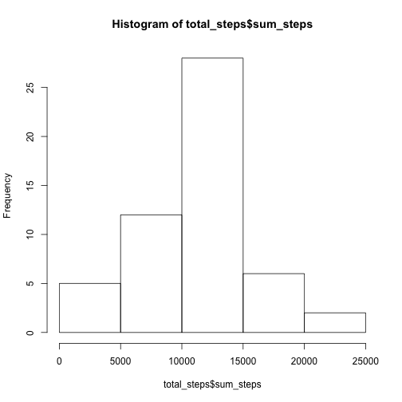
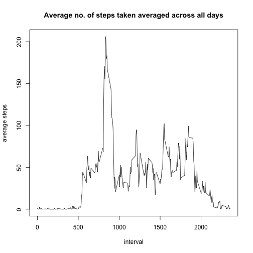
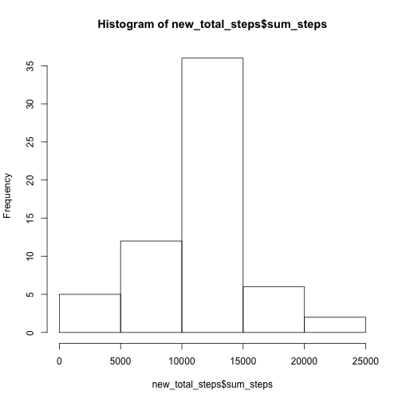
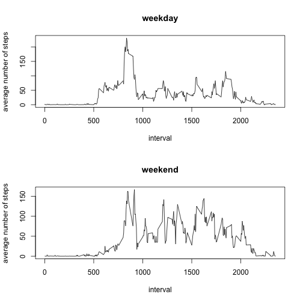

## Loading and preprocessing the data
1. Load the data


```r
activity <- read.csv("/Users/Lecia/Downloads/activity.csv", sep=",", header=TRUE)
head(activity)
```

```
##   steps       date interval
## 1    NA 2012-10-01        0
## 2    NA 2012-10-01        5
## 3    NA 2012-10-01       10
## 4    NA 2012-10-01       15
## 5    NA 2012-10-01       20
## 6    NA 2012-10-01       25
```

2. Process/transform the data into a format suitable for analysis


```r
proportion_missing_data = round(sum(is.na(activity$steps))/nrow(activity) * 100, 2)
old_row = nrow(activity)
clean_activity <- activity[complete.cases(activity), ]
new_row = nrow(clean_activity)
head(clean_activity)
```

```
##     steps       date interval
## 289     0 2012-10-02        0
## 290     0 2012-10-02        5
## 291     0 2012-10-02       10
## 292     0 2012-10-02       15
## 293     0 2012-10-02       20
## 294     0 2012-10-02       25
```

The percentage of missing values in the 'step' column is 13.11 %. After removing the missing values, the number of rows in the activity csv decreased from 17568 to 15264.

## What is the mean total number of steps taken per day

1. Calculate the total number of steps taken per day


```r
total_steps <- aggregate(clean_activity$steps, by=list(Date=clean_activity$date), FUN=sum)
colnames(total_steps)[2] <- "sum_steps"
print(total_steps)
```

```
##          Date sum_steps
## 1  2012-10-02       126
## 2  2012-10-03     11352
## 3  2012-10-04     12116
## 4  2012-10-05     13294
## 5  2012-10-06     15420
## 6  2012-10-07     11015
## 7  2012-10-09     12811
## 8  2012-10-10      9900
## 9  2012-10-11     10304
## 10 2012-10-12     17382
## 11 2012-10-13     12426
## 12 2012-10-14     15098
## 13 2012-10-15     10139
## 14 2012-10-16     15084
## 15 2012-10-17     13452
## 16 2012-10-18     10056
## 17 2012-10-19     11829
## 18 2012-10-20     10395
## 19 2012-10-21      8821
## 20 2012-10-22     13460
## 21 2012-10-23      8918
## 22 2012-10-24      8355
## 23 2012-10-25      2492
## 24 2012-10-26      6778
## 25 2012-10-27     10119
## 26 2012-10-28     11458
## 27 2012-10-29      5018
## 28 2012-10-30      9819
## 29 2012-10-31     15414
## 30 2012-11-02     10600
## 31 2012-11-03     10571
## 32 2012-11-05     10439
## 33 2012-11-06      8334
## 34 2012-11-07     12883
## 35 2012-11-08      3219
## 36 2012-11-11     12608
## 37 2012-11-12     10765
## 38 2012-11-13      7336
## 39 2012-11-15        41
## 40 2012-11-16      5441
## 41 2012-11-17     14339
## 42 2012-11-18     15110
## 43 2012-11-19      8841
## 44 2012-11-20      4472
## 45 2012-11-21     12787
## 46 2012-11-22     20427
## 47 2012-11-23     21194
## 48 2012-11-24     14478
## 49 2012-11-25     11834
## 50 2012-11-26     11162
## 51 2012-11-27     13646
## 52 2012-11-28     10183
## 53 2012-11-29      7047
```

2. Histogram of the total number of steps taken each day


```r
hist(total_steps$sum_steps)
```



3. Mean and median of the total number of steps taken per day


```r
print(paste0("Mean total number of steps per day: ", mean(total_steps$sum_steps)))
```

```
## [1] "Mean total number of steps per day: 10766.1886792453"
```

```r
print(paste0("Median total number of steps per day: ", median(total_steps$sum_steps)))
```

```
## [1] "Median total number of steps per day: 10765"
```

## What is the average daily activity pattern

1. Time series plot of 5-minute interval (x-axis) and the average number of steps taken, averaged across all days (y-axis)


```r
avg_daily_steps <- aggregate(clean_activity$steps, by=list(interval=clean_activity$interval), FUN=mean)
colnames(avg_daily_steps)[2] <- "avg_steps"
plot(avg_daily_steps$interval, avg_daily_steps$avg_steps, type="l",
     xlab="interval", ylab="average steps", main="Average no. of steps taken averaged across all days")
```



2. Which 5-minute interval, on average across all days contains the maximum number of steps


```r
max_interval_steps <- avg_daily_steps[which(avg_daily_steps$avg_steps == max(avg_daily_steps$avg_steps)),"interval"]
print(paste0("Between ", max_interval_steps, "a.m. and ", max_interval_steps+5, "a.m. contains the maximum number of steps"))
```

```
## [1] "Between 835a.m. and 840a.m. contains the maximum number of steps"
```

## Imputing missing values 

1. Total number of missing rows


```r
missing_rows = sum(is.na(activity$steps))
missing_rows
```

```
## [1] 2304
```

2/3. Filling missing data with average steps for that interval

```r
library(dplyr)
fill_activity <- activity %>% left_join(avg_daily_steps, by=c("interval"))
fill_activity[is.na(fill_activity$steps),'steps'] <- fill_activity[is.na(fill_activity$steps),"avg_steps"]
print("original data: ")
```

```
## [1] "original data: "
```

```r
head(activity)
```

```
##   steps       date interval
## 1    NA 2012-10-01        0
## 2    NA 2012-10-01        5
## 3    NA 2012-10-01       10
## 4    NA 2012-10-01       15
## 5    NA 2012-10-01       20
## 6    NA 2012-10-01       25
```

```r
print("new data: ")
```

```
## [1] "new data: "
```

```r
head(fill_activity)
```

```
##       steps       date interval avg_steps
## 1 1.7169811 2012-10-01        0 1.7169811
## 2 0.3396226 2012-10-01        5 0.3396226
## 3 0.1320755 2012-10-01       10 0.1320755
## 4 0.1509434 2012-10-01       15 0.1509434
## 5 0.0754717 2012-10-01       20 0.0754717
## 6 2.0943396 2012-10-01       25 2.0943396
```

4. Histogram of total number of steps taken each day; and mean and median total number of steps taken per day


```r
new_total_steps <- aggregate(fill_activity$steps, by=list(Date=fill_activity$date), FUN=sum)
colnames(new_total_steps)[2] <- "sum_steps"
print(head(new_total_steps))
```

```
##         Date sum_steps
## 1 2012-10-01  10766.19
## 2 2012-10-02    126.00
## 3 2012-10-03  11352.00
## 4 2012-10-04  12116.00
## 5 2012-10-05  13294.00
## 6 2012-10-06  15420.00
```

```r
hist(new_total_steps$sum_steps)
```



```r
print(paste0("Mean total number of steps per day: ", mean(new_total_steps$sum_steps)))
```

```
## [1] "Mean total number of steps per day: 10766.1886792453"
```

```r
print(paste0("Median total number of steps per day: ", median(new_total_steps$sum_steps)))
```

```
## [1] "Median total number of steps per day: 10766.1886792453"
```

The values for mean total number of steps taken per day doesn't differ as the mean for the 5-min interval was used to impute the missing values. On the other hand, the median differ slightly. The impact of imputing missing data on the estimates of the total daily number of steps is that the sum will be much larger than using the mean or median, which in turn influence other computations. 

## Are there differences in activity patterns between weekdays and weekends

1. Create a new factor variable in the dataset with two levels - "weekday" and "weekend" indicating whether a given date is a weekday or weekend day.


```r
fill_activity['days'] <- weekdays(as.Date(fill_activity$date))
fill_activity['week_type'] <- NA
weekends <- c('Saturday','Sunday')
weekdays <- c('Monday','Tuesday','Wednesday','Thursday','Friday')
fill_activity[which(fill_activity$days %in% weekends),'week_type'] <- "weekends"
fill_activity[which(fill_activity$days %in% weekdays),'week_type'] <- "weekdays"
head(fill_activity)
```

```
##       steps       date interval avg_steps   days week_type
## 1 1.7169811 2012-10-01        0 1.7169811 Monday  weekdays
## 2 0.3396226 2012-10-01        5 0.3396226 Monday  weekdays
## 3 0.1320755 2012-10-01       10 0.1320755 Monday  weekdays
## 4 0.1509434 2012-10-01       15 0.1509434 Monday  weekdays
## 5 0.0754717 2012-10-01       20 0.0754717 Monday  weekdays
## 6 2.0943396 2012-10-01       25 2.0943396 Monday  weekdays
```

2. Panel plot containing a time series plot of the 5-minute interval (x-axis) and the average number of steps taken, averaged across all weekday days or weekend days (y-axis).


```r
weekday_data <- fill_activity[which(fill_activity$week_type == "weekdays"),]
avg_weekday_steps <- aggregate(weekday_data$steps, by=list(interval=weekday_data$interval), FUN=mean)
colnames(avg_weekday_steps)[2] <- "avg_steps"

weekend_data <- fill_activity[which(fill_activity$week_type == "weekends"),]
avg_weekend_steps <- aggregate(weekend_data$steps, by=list(interval=weekend_data$interval), FUN=mean)
colnames(avg_weekend_steps)[2] <- "avg_steps"

par(mfrow=c(2,1))
plot(avg_weekday_steps$interval, avg_weekday_steps$avg_steps, type="l",
     xlab="interval", ylab="average number of steps", main="weekday")
plot(avg_weekend_steps$interval, avg_weekend_steps$avg_steps, type="l",
     xlab="interval", ylab="average number of steps", main="weekend")
```


